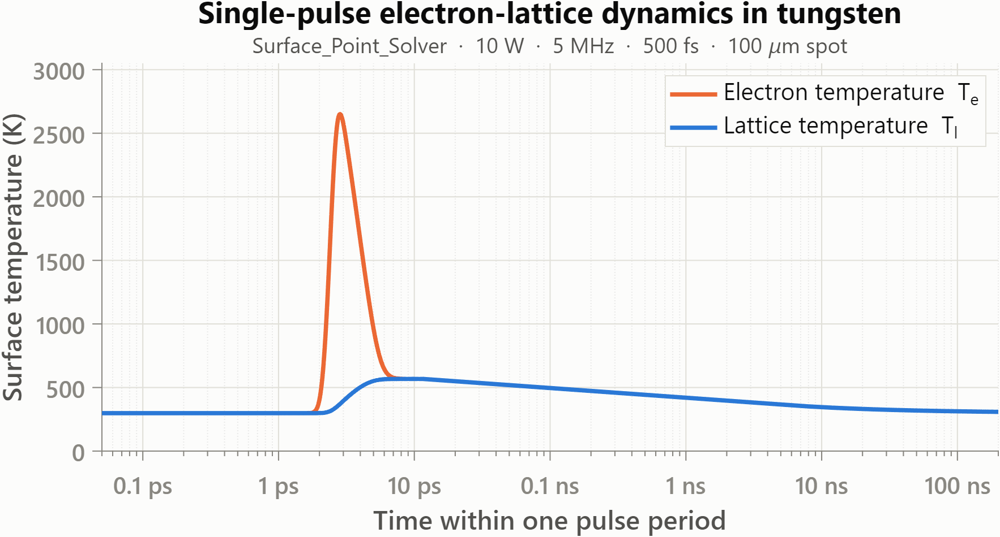
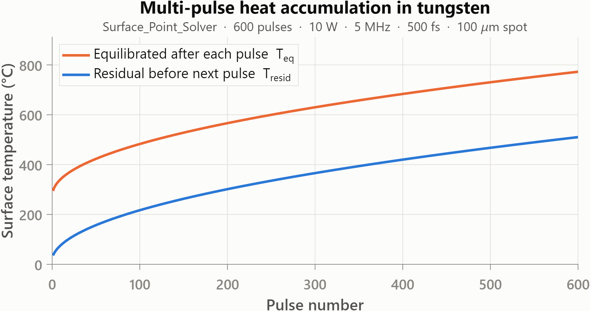
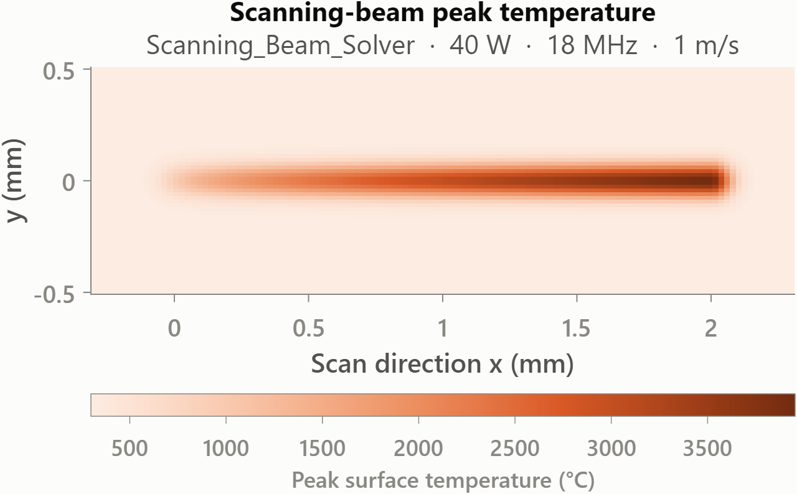
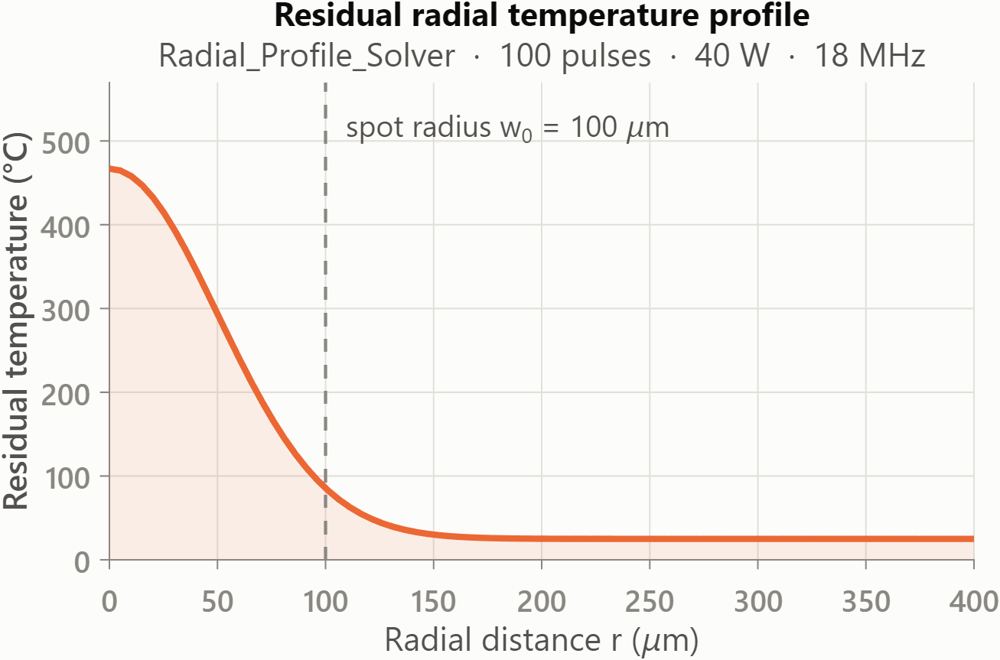

<p align="center">
  <picture>
    <source media="(prefers-color-scheme: dark)" srcset="docs/assets/banner-dark.png">
    
  </picture>
</p>

<p align="center">
  <a href="https://doi.org/10.1007/s11665-026-14738-6"></a>
  <a href="https://doi.org/10.5281/zenodo.20389305"></a>
  <a href="https://github.com/dfieser/ultrafast-laser-ttm-toolbox/releases"></a>
  <a href="LICENSE"></a>
  
</p>

MATLAB solvers for ultrafast pulsed-laser heating of metals, built on the two-temperature model (TTM). The toolbox spans single-pulse electron-lattice dynamics on femtosecond timescales, heat accumulation over thousands of pulses, and moving-beam scans. A two-stage solution strategy keeps multi-pulse simulations fast on a laptop.

The toolbox implements and generalizes the model published in:

> Fieser, D., Dewanjee, U. N., and Hu, A. (2026). *A Computationally Efficient Two-Stage Two-Temperature Model for Multi-pulse Femtosecond Laser Heat Accumulation in Tungsten*. Journal of Materials Engineering and Performance. [doi:10.1007/s11665-026-14738-6](https://doi.org/10.1007/s11665-026-14738-6)

The defaults reflect the tungsten work in the paper, but material presets (W, Cu, Au, Al) and a `custom` mode support other metals, pulse widths, spot sizes, repetition rates, and scanning conditions.

> [!NOTE]
> **This project is continued in Python at [ultrafast-laser-ttm-py](https://github.com/dfieser/ultrafast-laser-ttm-py).** All six solvers are available there as the `laserttm` package — no MATLAB required — validated solver-by-solver against this reference implementation, and new development happens in that repository. This MATLAB repository remains the paper's reference implementation, maintained in a stable, reproducibility-first mode.

## Highlights

- **Two-stage multi-pulse strategy.** Each pulse period splits into a full electron-lattice TTM solve (`ode15s`) during the pulse and relaxation, then Crank-Nicolson thermal diffusion for the inter-pulse gap. The baseline 50-pulse accumulation run finishes in under a second.
- **Six solver entry points.** 0D surface point, 1D depth-resolved, radial profile, single-pulse visualization, electron-lattice inversion analysis, and a scanning-beam surface model.
- **Captures the surface temperature inversion** (lattice hotter than electrons after the pulse), which requires depth resolution and is a focus of the companion paper.
- **Config-struct interfaces.** Every solver accepts a plain `cfg` struct and returns a results struct with a shared field contract, so runs are easy to script and automate.
- **Base MATLAB only.** No additional toolboxes are required.
- **Editable examples and batch runners** for parameter sweeps across power, repetition rate, pulse width, and spot size.

## Gallery

All figures below come from the solvers in this repository at their baseline example settings. The generating script is [docs/assets/generate_gallery.m](docs/assets/generate_gallery.m).

<p align="center">
  <picture>
    <source media="(prefers-color-scheme: dark)" srcset="docs/assets/fig_single_pulse-dark.png">
    
  </picture>
</p>
<p align="center"><em>Single-pulse electron-lattice dynamics at the tungsten surface (0D solver): the electron bath spikes above 2600 K within the 500 fs pulse, then equilibrates with the lattice through electron-phonon coupling in a few picoseconds.</em></p>

<p align="center">
  <picture>
    <source media="(prefers-color-scheme: dark)" srcset="docs/assets/fig_heat_accumulation-dark.png">
    
  </picture>
</p>
<p align="center"><em>Multi-pulse heat accumulation (0D solver, 600 pulses at 5 MHz): the equilibrated and residual surface temperatures climb pulse by pulse as heat arrives faster than it diffuses away.</em></p>

<table align="center">
  <tr>
    <td align="center" width="50%">
      <picture>
        <source media="(prefers-color-scheme: dark)" srcset="docs/assets/fig_scanning_map-dark.png">
        
      </picture><br>
      <em>Scanning-beam peak-temperature footprint (40 W, 18 MHz, 1 m/s): accumulation along the scan carries the peak past tungsten's 3422 &deg;C melt point.</em>
    </td>
    <td align="center" width="50%">
      <picture>
        <source media="(prefers-color-scheme: dark)" srcset="docs/assets/fig_radial_profile-dark.png">
        
      </picture><br>
      <em>Residual radial temperature profile after 100 pulses under a Gaussian spot.</em>
    </td>
  </tr>
</table>

## Getting Started

**Requirements:** a recent MATLAB release. The solvers use only base MATLAB (`ode15s`, standard array operations), so no toolboxes are needed.

1. Clone the repository and open MATLAB with the repo root as the working directory.
2. Add the solver folder to the path and run a baseline example:

```matlab
addpath(genpath('src'))
run('examples/Example_Surface_Point_Baseline.m')
```

Or call a solver directly with your own parameters:

```matlab
addpath(genpath('src'))

cfg = struct();
cfg.material    = 'W';            % tungsten preset ('Cu', 'Au', 'Al', 'custom')
cfg.Pavg        = 10;             % average power [W]
cfg.spotRadius  = 100e-6;         % 1/e^2 spot radius [m]
cfg.f_rep       = 5e6;            % repetition rate [Hz]
cfg.tau_FWHM    = 500e-15;        % pulse width, FWHM [s]
cfg.simDuration = 50 / cfg.f_rep; % simulate 50 pulses

results = Surface_Point_Solver(cfg);
```

Every run writes its text output under `outputs/` and returns a `results` struct you can inspect or post-process.

**Suggested progression:**

1. `examples/Example_Surface_Point_Baseline.m` for the simplest pulse-accumulation case
2. `examples/Example_Depth_Profile_Baseline.m` for the main 1D depth-resolved model
3. `examples/Example_Radial_Profile_Baseline.m` for radial spread under a Gaussian spot
4. `examples/Example_Scanning_Beam_Baseline.m` for a moving-beam process
5. `scripts/batch/` runners once single cases behave as expected

The [project wiki](https://github.com/dfieser/ultrafast-laser-ttm-toolbox/wiki) has a full getting-started walkthrough, a solver-by-solver reference with every config field, and notes on the model physics.

## Solvers

| Solver | File | What it computes | Best use |
| --- | --- | --- | --- |
| Surface point | [src/Surface_Point_Solver.m](src/Surface_Point_Solver.m) | 0D electron and lattice temperatures at the surface, with inter-pulse depth diffusion | fastest pulse-accumulation studies and sweeps |
| Depth profile | [src/Depth_Profile_Solver.m](src/Depth_Profile_Solver.m) | 1D depth-resolved Te(z,t) and Tl(z,t), per-pulse peaks, inversion metrics | main multi-pulse workflow; resolves the surface inversion |
| Radial profile | [src/Radial_Profile_Solver.m](src/Radial_Profile_Solver.m) | radial surface temperature under a Gaussian spot | melt-radius and footprint studies |
| Single pulse | [src/Single_Pulse_Visualizer.m](src/Single_Pulse_Visualizer.m) | one pulse with spatial snapshots at chosen delays | early-time inspection and teaching figures |
| Inversion analysis | [src/Inversion_Quantifier.m](src/Inversion_Quantifier.m) | per-pulse inversion magnitude, onset, and duration statistics | quantifying the Tl > Te inversion across pulses |
| Scanning beam | [src/Scanning_Beam_Solver.m](src/Scanning_Beam_Solver.m) | 2D surface temperature under a moving beam | translating stationary results to a scanned process |

All six accept a config struct (`cfg`, or `params` for the scanning solver) and return a results struct. Shared result fields across solvers: `solver`, `solverId`, `contractVersion`, `material`, `outputFile`, `outputDir`, and `inputConfig`, plus `nPulses` and `wallTime_s` where meaningful. The machine-readable contract lives in [docs/RESULT_CONTRACT_SCHEMA.json](docs/RESULT_CONTRACT_SCHEMA.json).

## Repository Layout

```text
ultrafast-laser-ttm-toolbox/
  src/              reusable solver functions
  examples/         editable single-run baseline scripts
  scripts/
    Verify_Public_Repo_Smoke.m   runtime smoke test
    batch/          reusable multi-case batch runners
  docs/             documentation, figures, and curation notes
  outputs/          default destination for generated results (untracked)
```

## Documentation

- [Project wiki](https://github.com/dfieser/ultrafast-laser-ttm-toolbox/wiki): getting started, solver reference, model background, batch workflows, and FAQ
- [examples/README.md](examples/README.md): example selection and editing pattern
- [scripts/README.md](scripts/README.md): smoke test and batch entry points
- [docs/VALIDATION_GUIDE.md](docs/VALIDATION_GUIDE.md): manual validation workflow
- [docs/PROJECT_CONTEXT.md](docs/PROJECT_CONTEXT.md) and [docs/REPOSITORY_NOTES.md](docs/REPOSITORY_NOTES.md): repository scope and curation history
- [AGENTS.md](AGENTS.md) and [docs/AGENT_QUICKSTART.md](docs/AGENT_QUICKSTART.md): guidance for coding agents, which this repository supports as a design goal

## How to Cite

If this toolbox contributes to published work, please cite the article:

```bibtex
@article{fieser2026twostage,
  author    = {Fieser, David and Dewanjee, Unmanaa Nileen and Hu, Anming},
  title     = {A Computationally Efficient Two-Stage Two-Temperature Model for
               Multi-pulse Femtosecond Laser Heat Accumulation in Tungsten},
  journal   = {Journal of Materials Engineering and Performance},
  publisher = {Springer},
  year      = {2026},
  doi       = {10.1007/s11665-026-14738-6},
}
```

To cite the software itself, use the version DOI from the Zenodo record (concept DOI [10.5281/zenodo.20389305](https://doi.org/10.5281/zenodo.20389305) always resolves to the latest release) or the metadata in [CITATION.cff](CITATION.cff):

```bibtex
@software{fieser_ttm_toolbox,
  author = {Fieser, David},
  title  = {Ultrafast Laser TTM Toolbox},
  year   = {2026},
  doi    = {10.5281/zenodo.20389305},
  url    = {https://github.com/dfieser/ultrafast-laser-ttm-toolbox},
}
```

**Title note:** some records, including the NSF award listing, cite this article under its earlier working title "A Computationally Efficient Analytic Two-Temperature Model for Multi-Pulse Femtosecond Laser Heat Accumulation in Metals: Application to Tungsten." The title changed shortly before publication. Both titles refer to the same article, DOI [10.1007/s11665-026-14738-6](https://doi.org/10.1007/s11665-026-14738-6).

## Versioning and Releases

The `VERSION` file at the repository root is the single source of truth (also returned by `Toolbox_Version()` in MATLAB). `CITATION.cff` and `.zenodo.json` must state the same version; the release workflow checks this. Bumping `VERSION` on `main` tags the commit, creates a GitHub release, and Zenodo archives it under a new version DOI. See [.github/workflows/release.yml](.github/workflows/release.yml).

## License

Released under the MIT License. See [LICENSE](LICENSE).

## Acknowledgments and Funding

This work was supported by the National Science Foundation under Award No. CMMI-2412544, Collaborative Research: Additive Manufacturing of Crack-Free Tungsten Using Ultrashort Pulsed Lasers (PI: Dr. Anming Hu, Division of Civil, Mechanical, and Manufacturing Innovation, NSF Program: AM-Advanced Manufacturing).

The authors gratefully acknowledge Drs. Yanfei Gao, Wenda Tan, and Seungha Shin for their contributions and collaboration on this project.

Additional support was provided by the University of Tennessee, Knoxville, through a hiring package. D.F. gratefully acknowledges support from the UTK 100 Talented PhD Scholarship.

Support for the Center for Materials Processing from the State of Tennessee and the Tennessee Higher Education Commission is also gratefully acknowledged.

## Contributing

Bug fixes, portability improvements, and documentation polish are welcome. See [CONTRIBUTING.md](CONTRIBUTING.md) for scope guidance.
